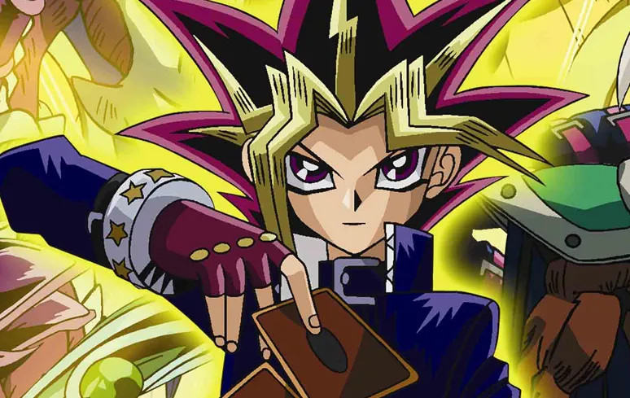

# Info


This small project is a simple memory game based on cards of yu-gi-oh anime.
It was created as a pratice for HTML, CSS and JS. Below there is some
links and tips wich I used to build it.

In initial page is possible configure a number of replics per card, the default
value is one. Your username is taken to format win message at end game.


Site used to take cards images: [yu-gi-oh](https://www.formatlibrary.com/cards/)



## Wrap up

The main knowledge used to build it was concernig of:
- Add/Remove elements from HTML page.
- Change CSS values through JS.
- How to enable/disable events listeners to avoid user interact with web page during a amount of time.
- Array handling for shuffle cards and execute a for each.
- About CSS: Basic usage of flexbox and background images.
- QuerySelector to capture elements.

Some enhance poits of it's project are:
- Mobile usage, for phones using portraint mode each card is positioned one below other and it make the gameplay terrible.
- Gameplay, actually is impossible lose the game. Maybe a timer or max number of clicks can be added.
- Refactory some part of the code. This should be done because some event listeners are added and removed to avoid user clicks in a certain point of game, actually some work arround is implanted. :')

Finally, during this little adventure I get into a issue: "The event listeners are dispatch in some specific order ? Can I handle it ?" Last topic has a link wich explains it.

## Tricks JS

```js
node.clone(true) // Clone element and descendants.
node.remove() // Delete elemente
node.after(elem) // Insert element after

node.setAttribute("id", "value");
node.getAttribute("id");

parentDiv.insertBefore(newNode, referenceNode); // Insert element before
```

### Delay, Sleep, Pause, Wait

[How to use this functions](https://www.sitepoint.com/delay-sleep-pause-wait/)

- setTimeout
```js
setTimeout(func, delay, param1, param2, param3 );
```


- sleep
```js
// Block next code execution
function sleep(milliseconds) {
  const date = Date.now();
  let currentDate = null;
  do {
    currentDate = Date.now();
  } while (currentDate - date < milliseconds);
}

// Less intrusive sleep.
function sleep(ms) {
  return new Promise(resolve => setTimeout(resolve, ms));
}

console.log("Hello");
sleep(2000).then(() => { console.log("World!"); });
```
### Precedence of events

[Events precedence](https://www.quirksmode.org/js/events_order.html#link4)

- Event capturing: Top down.
- Event bubbling: Bottom up.

#### Example

```js
element1.addEventListener('click',doSomething2,true) // Capturing
element2.addEventListener('click',doSomething,false) // Bubbling
```

What goes here ?
- Element 2 is clicked and trow event.
- Element 1 function's is executed on capturing phasse, so it comes first.
- Element 2 function's is execute.
